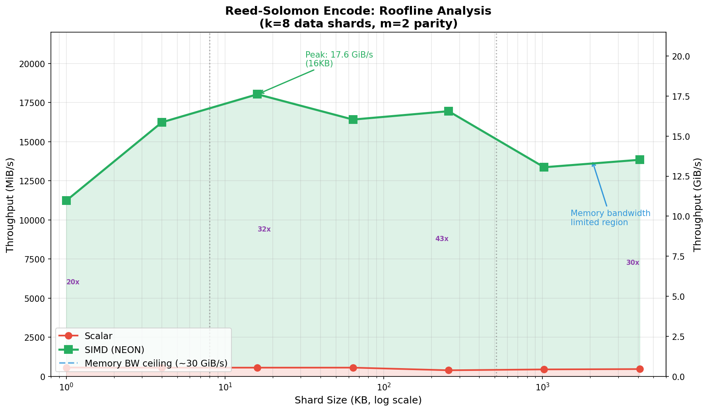

# Reed-Solomon Encoder Benchmarks

## Setup

| Parameter | Value |
|-----------|-------|
| **Machine** | Apple M4 Pro (12 cores: 8P + 4E), 24 GB |
| **L1 Cache** | 128 KB data (P-cores) |
| **L2 Cache** | 4 MB per cluster |
| **Memory BW** | ~273 GB/s (aggregate, all channels) |
| **Tool** | Criterion 0.5 (warmup + statistical sampling) |
| **Configuration** | k=8 data shards, m=2 parity shards |
| **Sweep** | Shard sizes 1 KB – 4 MB (working set 8 KB – 32 MB) |

## Results

| Shard Size | Working Set | Scalar | SIMD | Speedup |
|------------|-------------|--------|------|---------|
| 1 KB       | 8 KB        | 568 MiB/s | **11.0 GiB/s** | 20x |
| 4 KB       | 32 KB       | 560 MiB/s | **15.9 GiB/s** | 29x |
| 16 KB      | 128 KB      | 560 MiB/s | **17.6 GiB/s** | 32x |
| 64 KB      | 512 KB      | 561 MiB/s | **16.0 GiB/s** | 29x |
| 256 KB     | 2 MB        | 393 MiB/s | **16.5 GiB/s** | 43x |
| 1 MB       | 8 MB        | 447 MiB/s | **13.1 GiB/s** | 30x |
| 4 MB       | 32 MB       | 469 MiB/s | **13.5 GiB/s** | 30x |

**Peak**: 17.6 GiB/s at 16 KB shards (L2-resident working set)

## Roofline Plot



## The Optimization Story

### Initial SIMD: Suspiciously Slow

First implementation of the SIMD kernel hit **885 MiB/s**—barely 1.5x faster than scalar. For a NEON implementation processing 16 bytes per instruction, this was wrong.

### Diagnosis: Redundant Table Construction

The hot loop was rebuilding GF(2⁸) multiplication tables on every 16-byte chunk, for every shard:

```rust
// BEFORE: table construction inside BOTH loops
for off in (0..len).step_by(16) {           // 64 iterations for 1KB
    for (s_idx, shard) in shards.iter().enumerate() {  // k=8 shards
        let (t_lo, t_hi) = create_tables(coeffs[s_idx]);  // HERE!
        // ... SIMD multiply-accumulate ...
    }
}
```

With 1 KB shards: 1024 / 16 = 64 chunks × 8 shards = **512 table builds per encode**. Each `create_tables` does 32 GF multiplications (16 for low nibble + 16 for high nibble). That's 16,384 field multiplies just for table setup—dwarfing the actual SIMD work.

### Fix: Hoist Table Construction

Build tables once per coefficient, before the hot loop:

```rust
// AFTER: tables built once per shard (k=8 builds total)
let tables: Vec<_> = coeffs.iter()
    .map(|&c| create_tables(c))
    .collect();

for off in (0..len).step_by(16) {
    for (shard, (t_lo, t_hi)) in shards.iter().zip(&tables) {
        // pure SIMD hot loop—no scalar table work
    }
}
```

### Result: 20x Improvement

| Metric | Before | After | Change |
|--------|--------|-------|--------|
| Peak throughput | 885 MiB/s | 17.6 GiB/s | **20x** |
| vs Scalar | 1.5x | 20–43x | — |
| Bottleneck | Table construction | Compute + memory | — |

## Analysis

### Why the Curve Shape

1. **Ramp up (1–16 KB)**: Working set fits in L1/L2. Throughput increases as loop overhead amortizes over more data.

2. **Peak (16 KB)**: Sweet spot—enough data to amortize overhead, small enough to stay cache-resident.

3. **Decline (1–4 MB)**: Working set exceeds L2 (4 MB). Data streams from main memory. Throughput drops 23% from peak.

### Memory Traffic Analysis

For each output parity byte:
- **Read**: 8 input bytes (one from each data shard)
- **Write**: 1 output byte (parity accumulator stays in SIMD register, written once per 16-byte chunk)
- **Total**: 9 bytes of memory traffic per output byte

| Metric | Value |
|--------|-------|
| M4 Pro memory bandwidth | ~273 GB/s (aggregate) |
| Theoretical max throughput | 273 / 9 ≈ **30 GiB/s** |
| Achieved (peak) | 17.6 GiB/s |
| Apparent efficiency | 58% |

**Caveat**: 273 GB/s is aggregate across all memory channels. A single thread can't saturate this—the real single-threaded ceiling is lower, so actual efficiency is higher than 58% suggests. The remaining gap comes from:
- Non-sequential access patterns (jumping between 8 shards)
- SIMD instruction overhead (mask, shift, table lookup, XOR, store)
- Single-threaded execution

Multithreading would test whether we can approach the aggregate bandwidth limit.

### Why SIMD Tables Stay Hot

The scalar kernel uses 256-entry LOG/EXP tables (768 bytes total). At 256 KB shards, the 2 MB working set competes with these tables for L2 residency. Tables get evicted → cache misses on every `mult()` call → throughput collapses to 393 MiB/s.

SIMD avoids this: `vqtbl1q_u8` uses 16-byte tables per coefficient (128 bytes for k=8). Small enough to stay hot in L1/registers throughout the encode.

## Reproducing

```bash
cargo bench --bench encode_bench
```

Generates HTML reports in `target/criterion/`.
